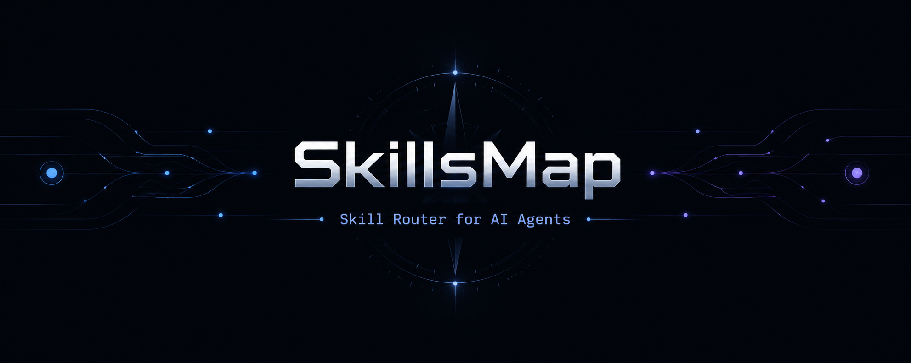
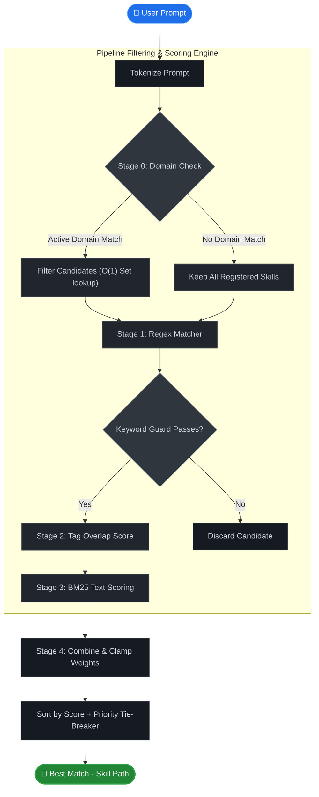

<p align="center">
  
</p>

<p align="center">
  <strong>Skill Router for AI Agents</strong><br>
  <em>Route prompts to the right skill in under 1ms. No LLM calls. No embeddings. Pure deterministic scoring.</em>
</p>

<p align="center">
  
  
  
  
  
  
</p>

<p align="center">
  <a href="#quick-start">Quick Start</a> •
  <a href="#how-it-works">How It Works</a> •
  <a href="#cli-reference">CLI</a> •
  <a href="#sdk-usage">SDK</a> •
  <a href="#performance">Performance</a> •
  <a href="#security">Security</a>
</p>

---

## Why SkillsMap?

Your AI agent has 50 skills. Every prompt loads all 50 into context — burning tokens, wasting memory, confusing the model.

| | Without SkillsMap | With SkillsMap |
|:---|:---|:---|
| **Context cost** | Load all 50 skills (~12,000 tokens) | Load 1 skill (~200 tokens) |
| **Match speed** | LLM call (~2,000ms) | Deterministic scoring (< 1ms) |
| **Accuracy** | Model "guesses" from a long list | BM25 + regex + tag hybrid ranking |
| **Skill management** | Manual file copying | `install` / `register` / `uninstall` CLI |
| **Dependency tracking** | None | DAG validation with cycle detection |

---

## How It Works

A 4-stage pipeline filters and scores every registered skill against the user's prompt.

<details>
<summary>🔍 点击展开查看管道过滤与评分架构图 (Click to view pipeline flowchart)</summary>



</details>


**Stage 0 — Domain Classification**  
Filter candidates by domain keywords using O(1) Set lookups. Eliminates ~80% of skills instantly.

**Stage 1 — Regex Matching**  
Deterministic pattern matching. Protected against ReDoS (lookarounds, backreferences, nested quantifiers blocked).

**Stage 2 — Tag Overlap**  
Measures prompt-to-tag coverage with sub-linear normalization: `√(intersection / |tags|)`. Favors neither sparse nor dense tag sets.

**Stage 3 — BM25 Ranking**  
Classic information retrieval scoring with incremental disk-cached index. Falls back to in-memory computation on cache miss.

**Final Score**  
`w1·regex + w2·tag + w3·bm25 + w4·priority`, clamped to [0, 1]. Tie-breaking: priority → definition order.

---

## Quick Start

```bash
# Install globally
npm install -g @skillsmap/core

# Generate a config template
skillsmap init

# Register a local skill folder
skillsmap register ./my-skills/git-helper

# Or install from GitHub
skillsmap install https://github.com/user/skill-git.git

# Route a prompt
skillsmap route "help me rebase my git branch"
```

```
🔍 Matching prompt: "help me rebase my git branch"
✅ Match Found: git-helper
   Path: /home/user/.skillsmap/skills/git-helper/index.js
   Total Score: 0.92 (Regex: 0.00, Tag: 0.71, BM25: 0.95)
   Routing Pathway: git-helper
⏱️  Time: 0.7ms
```

---

## CLI Reference

| Command | Description |
|:---|:---|
| `skillsmap init` | Generate a template `skillsmap.json` with schema link |
| `skillsmap install <git-url>` | Clone and register a skill from Git |
| `skillsmap register <path>` | Register a local skill directory (symlink) |
| `skillsmap uninstall <id> [-f]` | Remove a skill (blocks if others depend on it) |
| `skillsmap list [--format json] [--domain <x>]` | List all registered skills |
| `skillsmap route "<prompt>" [--top N] [--verbose]` | Route prompt to best matching skill |
| `skillsmap validate [-c <path>]` | Check DAG cycles, entrypoints, schema |
| `skillsmap index [-r]` | Rebuild BM25 index (incremental, `-r` forces) |
| `skillsmap dashboard [-p 4500]` | Start the telemetry cockpit server |

---

## Define a Skill

Each skill is a folder with a `skill.json`:

```json
{
  "id": "deploy-aws",
  "name": "Deploy to AWS",
  "description": "Deploys containerized apps to AWS ECS or Lambda",
  "path": "./index.js",
  "tags": ["aws", "deploy", "ecs", "lambda", "cloud"],
  "domain": "cloud",
  "category": "devops",
  "priority": 0.3,
  "dependencies": ["dockerize"],
  "triggers": {
    "regex": ["^deploy.*aws$"],
    "keywords": ["aws", "deploy"],
    "keywordsMatch": "any"
  }
}
```

<details>
<summary><strong>Full field reference</strong></summary>

| Field | Type | Required | Default | Description |
|:---|:---|:---:|:---:|:---|
| `id` | `string` | ✅ | — | Unique identifier (alphanumeric, `-`, `_`) |
| `name` | `string` | ✅ | — | Human-readable label |
| `description` | `string` | ✅ | — | Text used for BM25 semantic matching |
| `path` | `string` | ✅ | — | Relative path to the entrypoint file |
| `tags` | `string[]` | ✅ | — | Keywords for tag overlap scoring |
| `domain` | `string` | | — | Domain for Stage 0 pre-filtering |
| `category` | `string` | | — | Free-form secondary classification |
| `dependencies` | `string[]` | | `[]` | Skill IDs that must run first |
| `priority` | `number` | | `0` | Score bias in [-1.0, 1.0] |
| `triggers.regex` | `string[]` | | — | Regex patterns (ReDoS-safe) |
| `triggers.keywords` | `string[]` | | — | Required trigger keywords |
| `triggers.keywordsMatch` | `"all" \| "any" \| number` | | `"any"` | How many keywords must match |

</details>

---

## Configuration

SkillsMap uses a **dual-layer configuration** system:

| Layer | Location | Purpose |
|:---|:---|:---|
| **Global** | `~/.skillsmap/skillsmap.json` | Auto-generated from installed skills |
| **Project** | `./skillsmap.json` | Optional overrides, can `extends` global |

```json
{
  "$schema": "node_modules/@skillsmap/core/skillsmap.schema.json",
  "extends": true,
  "fallbackNodeId": "general-helper",
  "domains": {
    "gamedev": ["unity", "unreal", "godot", "sprite"]
  },
  "skills": [...]
}
```

**Discovery order:** `--config` flag → `$SKILLSMAP_CONFIG_PATH` → `./skillsmap.json` → `~/.skillsmap/skillsmap.json`

---

## SDK Usage

```typescript
import { Router, Installer } from '@skillsmap/core';

// ── Routing ──────────────────────────────────────────────
const router = new Router(skills, 'fallback-id', customDomains, configPath, {
  regex: 1.0,   // weight for regex stage
  tag: 0.4,     // weight for tag overlap
  bm25: 0.5,    // weight for BM25 ranking
  priority: 0.1 // weight for priority bias
});

const result = await router.route('deploy to aws', {
  top: 3,       // return top N matches
  verbose: true, // debug output to stderr
  noCache: true  // skip disk BM25 index
});

console.log(result.match.id);      // "deploy-aws"
console.log(result.match.score);   // 0.94
console.log(result.pathway);       // ["dockerize", "deploy-aws"]
console.log(result.metrics);       // { regexScore, tagScore, bm25Score, executionTimeMs }

// ── Package Management ───────────────────────────────────
const installer = new Installer('/custom/store');

await installer.installFromGit('https://github.com/user/skill.git');
await installer.registerLocal('./my-local-skill');
await installer.uninstall('old-skill', true); // force override deps

const all = await installer.list('json');
```

---

## Performance

Benchmarked with 100 registered skills on Node 20:

| Metric | Value | Target |
|:---|:---|:---|
| **p50 latency** | `0.89ms` | < 3ms ✅ |
| **p99 latency** | `2.32ms` | < 8ms ✅ |
| **Cold start memory** | `< 15MB` | < 15MB ✅ |
| **BM25 index build (100 skills)** | `~4ms` | — |

```bash
pnpm bench    # run benchmarks yourself
```

---

## Security

| Threat | Protection |
|:---|:---|
| **Remote Code Execution** | Git URL whitelist (GitHub HTTPS/SSH only) |
| **Path Traversal** | All file ops sandboxed to `~/.skillsmap/skills/` |
| **ReDoS** | Regex triggers validated: no lookarounds, backreferences, nested quantifiers |
| **Dependency Conflicts** | `uninstall` blocks if other skills depend on target (override with `-f`) |
| **Root Directory Registration** | Cannot register `/` or the store directory itself |

---

## Project Structure

```
SkillsMap/
├── packages/
│   ├── core/                      # The published package (@skillsmap/core)
│   │   ├── src/
│   │   │   ├── router.ts          # 4-stage routing engine
│   │   │   ├── installer.ts       # Git/local skill installer
│   │   │   ├── registry.ts        # Registry + BM25 index builder
│   │   │   ├── config.ts          # Dual-layer config loader
│   │   │   ├── validation.ts      # Schema + DAG + regex validation
│   │   │   ├── server.ts          # Dashboard HTTP API server
│   │   │   ├── demo-skills.ts     # Built-in demo skill set
│   │   │   └── cli.ts             # Commander-based CLI entry
│   │   ├── skillsmap.schema.json  # JSON Schema for IDE autocompletion
│   │   └── tests/                 # 94 tests (unit + E2E + benchmarks)
│   └── dashboard/                 # Telemetry cockpit (Vite + React + SVG)
├── .github/workflows/ci.yml       # CI: lint, build, test, bench (Node 18 & 20)
├── eslint.config.js               # Flat ESLint config
└── CHANGELOG.md
```

---

## Contributing

```bash
git clone https://github.com/LuzLiang/SkillsMap.git
cd SkillsMap
pnpm install
pnpm test        # run tests
pnpm bench       # run benchmarks
pnpm lint        # check code style
```

PRs welcome. Please ensure:
- All tests pass (`pnpm test`)
- Coverage stays above 90% line / 85% branch
- No ESLint errors (`pnpm lint`)

---

## License

[MIT](LICENSE) · Made with 🗺️ by [LuzLiang](https://github.com/LuzLiang)
