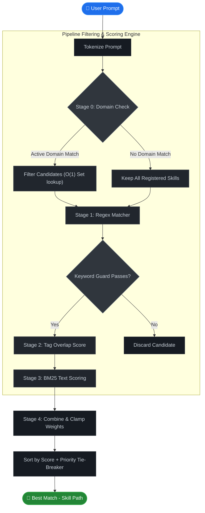

<p align="center">
  
</p>

<p align="center">
  <strong>面向 AI Agent 的技能路由引擎 (Skill Router)</strong><br>
  <em>小于 1 毫秒内将 Prompt 路由到最合适的 Agent 技能。无需 LLM 调用，无需向量嵌入，纯确定性评分。</em>
</p>

<p align="center">
  
  
  
  
  
  
</p>

<p align="center">
  <a href="#快速上手">快速上手</a> •
  <a href="#工作原理">工作原理</a> •
  <a href="#cli-命令参考">CLI</a> •
  <a href="#sdk-使用指南">SDK</a> •
  <a href="#性能表现">性能表现</a> •
  <a href="#安全特性">安全特性</a>
</p>

<p align="center">
  🌐 <a href="README.md">English</a> | <strong>简体中文</strong>
</p>

---

## 为什么选择 SkillsMap？

如果您的 AI Agent 拥有 50 个技能，普通的做法是在每次交互时将所有 50 个技能的说明都加载到上下文窗口中 —— 这会消耗大量 Token，浪费内存，并且容易让大模型感到困惑。

| | 未使用 SkillsMap | 使用 SkillsMap |
|:---|:---|:---|
| **上下文开销** | 加载所有 50 个技能 (~12,000 tokens) | **仅加载 1 个匹配技能 (~200 tokens)** |
| **匹配速度** | 调用大模型判断 (~2,000ms) | **确定性评分过滤 (< 1ms)** |
| **匹配精度** | 模型从冗长的列表中“猜测” | **BM25 + 正则 + 标签混合多级排序** |
| **技能管理** | 手动复制代码和文件 | **一键命令行 `install` / `register` / `uninstall`** |
| **依赖追踪** | 无 | **支持循环检测的 DAG 依赖图验证** |

---

## 工作原理

SkillsMap 使用一个 4 阶段过滤管道对每个注册的技能进行评分，将用户 Prompt 精准投递至目标技能。

<details>
<summary>🔍 点击展开查看管道过滤与评分架构图 (Click to view pipeline flowchart)</summary>



</details>

**Stage 0 — 领域预分类 (Domain Classification)**  
基于 `O(1)` 哈希表匹配领域关键词。瞬间排除大约 80% 无关领域的技能。

**Stage 1 — 正则表达式匹配 (Regex Matching)**  
进行确定性的正则模式匹配。默认拦截前瞻、后顾和嵌套量词，防止 ReDoS（正则拒绝服务攻击）。

**Stage 2 — 标签重合度评分 (Tag Overlap)**  
衡量 Prompt 与技能标签的覆盖率，采用亚线性归一化算法：`√(intersection / |tags|)`，对标签过少或过密的技能一视同仁。

**Stage 3 — BM25 相似度排行 (BM25 Ranking)**  
经典的文本信息检索算法，支持增量生成的本地磁盘缓存索引，若缓存未命中则回退至内存计算。

**最终得分 (Final Score)**  
`w1·regex + w2·tag + w3·bm25 + w4·priority`，限制在 `[0, 1]` 区间。如有平分，则优先按技能声明中的 `priority` 排序，其次按注册顺序。

---

## 快速上手

```bash
# 全局安装 CLI 工具
npm install -g @skillsmap/core

# 在当前目录下生成模板配置文件 skillsmap.json
skillsmap init

# 注册一个本地的技能文件夹 (自动创建符号链接)
skillsmap register ./my-skills/git-helper

# 也可以直接从 GitHub 仓库安装技能
skillsmap install https://github.com/user/skill-git.git

# 路由并匹配指令
skillsmap route "help me rebase my git branch"
```

```
🔍 Matching prompt: "help me rebase my git branch"
✅ Match Found: git-helper
   Path: /home/user/.skillsmap/skills/git-helper/index.js
   Total Score: 0.92 (Regex: 0.00, Tag: 0.71, BM25: 0.95)
   Routing Pathway: git-helper
⏱️  Time: 0.7ms
```

---

## CLI 命令参考

| 命令 | 描述 |
|:---|:---|
| `skillsmap init` | 生成包含 Schema 链接的模板配置文件 `skillsmap.json` |
| `skillsmap install <git-url>` | 从 Git 仓库克隆并注册一个技能 |
| `skillsmap register <path>` | 注册一个本地技能文件夹 (创建 symlink) |
| `skillsmap uninstall <id> [-f]` | 卸载某个技能 (如果被其他技能依赖则会报错阻断，可用 `-f` 强行忽略) |
| `skillsmap list [--format json] [--domain <x>]` | 列出当前所有注册成功的技能 |
| `skillsmap route "<prompt>" [--top N] [--verbose]` | 路由并检索最契合的技能 |
| `skillsmap validate [-c <path>]` | 校验 DAG 循环依赖、入口文件存在性及 Schema 格式 |
| `skillsmap index [-r]` | 构建 BM25 倒排索引 (默认增量构建，使用 `-r` 可强制重建) |
| `skillsmap dashboard [-p 4500]` | 启动本地可视化调试面板服务器 |

---

## 声明技能配置文件

每个技能都是一个包含 `skill.json` 配置的独立文件夹：

```json
{
  "id": "deploy-aws",
  "name": "Deploy to AWS",
  "description": "Deploys containerized apps to AWS ECS or Lambda",
  "path": "./index.js",
  "tags": ["aws", "deploy", "ecs", "lambda", "cloud"],
  "domain": "cloud",
  "category": "devops",
  "priority": 0.3,
  "dependencies": ["dockerize"],
  "triggers": {
    "regex": ["^deploy.*aws$"],
    "keywords": ["aws", "deploy"],
    "keywordsMatch": "any"
  }
}
```

<details>
<summary><strong>配置文件字段详解</strong></summary>

| 字段 | 类型 | 是否必填 | 默认值 | 描述 |
|:---|:---|:---:|:---:|:---|
| `id` | `string` | ✅ | — | 唯一标识符（只允许字母、数字、`-`、`_`） |
| `name` | `string` | ✅ | — | 人类可读的技能标签名称 |
| `description` | `string` | ✅ | — | 技能描述文本，用于 BM25 语义召回检索 |
| `path` | `string` | ✅ | — | 指向技能入口文件的相对路径 |
| `tags` | `string[]` | ✅ | — | 标签列表，用于 Stage 2 标签重合度打分 |
| `domain` | `string` | | — | 所属领域，用于 Stage 0 粗筛 |
| `category` | `string` | | — | 自定义辅助分类，无检索逻辑 |
| `dependencies` | `string[]` | | `[]` | 依赖的其他技能 ID (当前技能运行前必须先安装/运行) |
| `priority` | `number` | | `0` | 平分时的偏置分，范围为 [-1.0, 1.0] |
| `triggers.regex` | `string[]` | | — | 正则表达式触发模式 (防止 ReDoS 攻击) |
| `triggers.keywords` | `string[]` | | — | 必选触发关键字过滤列表 |
| `triggers.keywordsMatch` | `"all" \| "any" \| number` | | `"any"` | 必须满足多少个关键字才通过 |

</details>

---

## 配置文件加载机制

SkillsMap 采用 **双层配置** 体系：

| 配置层级 | 路径 | 用途 |
|:---|:---|:---|
| **全局配置** | `~/.skillsmap/skillsmap.json` | 包含所有通过 `install` / `register` 安装的技能列表，自动维护 |
| **项目级配置** | `./skillsmap.json` | 放置在具体项目根目录下，可使用 `extends: true` 继承全局技能，并覆盖特定字段 |

```json
{
  "$schema": "node_modules/@skillsmap/core/skillsmap.schema.json",
  "extends": true,
  "fallbackNodeId": "general-helper",
  "domains": {
    "gamedev": ["unity", "unreal", "godot", "sprite"]
  },
  "skills": [...]
}
```

**加载优先级顺序：** `--config` 命令行参数 → 环境变量 `$SKILLSMAP_CONFIG_PATH` → 当前目录 `./skillsmap.json` → 用户全局目录 `~/.skillsmap/skillsmap.json`。

---

## SDK 使用指南

您可以在自己的 Node 项目中直接引入并运行 SkillsMap：

```typescript
import { Router, Installer } from '@skillsmap/core';

// ── 1. 技能路由匹配 ──────────────────────────────────────────
const router = new Router(skills, 'fallback-id', customDomains, configPath, {
  regex: 1.0,   // 正则匹配权重
  tag: 0.4,     // 标签匹配权重
  bm25: 0.5,    // BM25 相似度权重
  priority: 0.1 // 偏置优先级权重
});

const result = await router.route('deploy to aws', {
  top: 3,       // 返回前 N 个最匹配项
  verbose: true, // 将调试细节输出至 stderr (不污染 stdout)
  noCache: true  // 强制跳过磁盘 BM25 倒排索引缓存
});

console.log(result.match.id);      // 命中的技能ID: "deploy-aws"
console.log(result.match.score);   // 最终得分: 0.94
console.log(result.pathway);       // 拓扑调用链路: ["dockerize", "deploy-aws"]
console.log(result.metrics);       // 各阶段分值指标: { regexScore, tagScore, bm25Score, executionTimeMs }

// ── 2. 技能包管理 ───────────────────────────────────────────
const installer = new Installer('/custom/store');

await installer.installFromGit('https://github.com/user/skill.git');
await installer.registerLocal('./my-local-skill');
await installer.uninstall('old-skill', true); // 传入 true 表示强制卸载，忽略依赖警报

const all = await installer.list('json');
```

---

## 性能表现

在拥有 100 个注册技能的真实环境下基于 Node 20 运行基准测试的成绩：

| 指标 | 测试成绩 | 指标目标 |
|:---|:---|:---|
| **p50 延迟** | `0.89ms` | < 3ms ✅ |
| **p99 延迟** | `2.32ms` | < 8ms ✅ |
| **冷启动额外内存开销** | `< 15MB` | < 15MB ✅ |
| **BM25 倒排索引构建耗时 (100个技能)** | `~4ms` | — |

```bash
pnpm bench    # 在本地运行基准性能测试
```

---

## 安全特性

| 面临威胁 | 系统防御手段 |
|:---|:---|
| **远程代码执行 (RCE)** | 强校验 Git URL 规则，仅白名单支持官方 GitHub HTTPS/SSH 格式 |
| **目录穿越攻击 (Path Traversal)** | 所有本地读写操作均严格沙箱隔离在 `~/.skillsmap/skills/` 下 |
| **正则炸弹 (ReDoS)** | 输入触发正则会被静态校验并编译拦截，禁止环视、反向引用、嵌套量词等高耗性能特性 |
| **断裂依赖冲突** | `uninstall` 默认会校验依赖拓扑树，如被其他技能依赖则会拒绝卸载（支持 `-f` 强行覆盖） |
| **根目录误注册风险** | 检测非沙箱安全路径，严禁将 `/` 根目录或 store 存放空间本身注册为技能 |

---

## 项目结构

```
SkillsMap/
├── packages/
│   ├── core/                      # 发布的 NPM 包 (@skillsmap/core)
│   │   ├── src/
│   │   │   ├── router.ts          # 4阶段路由评分引擎
│   │   │   ├── installer.ts       # 本地与 Git 技能包管理器
│   │   │   ├── registry.ts        # 全局注册表和 BM25 缓存管理器
│   │   │   ├── config.ts          # 双层配置文件加载器
│   │   │   ├── validation.ts      # Schema校验、DAG环路校验、安全校验
│   │   │   ├── server.ts          # Telemetry 仪表盘 Node 原生服务端
│   │   │   ├── demo-skills.ts     # 内置演示技能包配置
│   │   │   └── cli.ts             # 命令行工具入口 (Commander.js)
│   │   ├── skillsmap.schema.json  # 提供 IDE 配置自动补全的 JSON Schema
│   │   └── tests/                 # 94 个单元测试、E2E 测试与性能测试用例
│   └── dashboard/                 # 仪表盘前端工程 (Vite + React + TailwindCSS)
├── .github/workflows/ci.yml       # GitHub Actions 持续集成流程
├── eslint.config.js               # ESM 规范代码格式规范文件
└── CHANGELOG.md
```

---

## 参与贡献

```bash
git clone https://github.com/LuzLiang/SkillsMap.git
cd SkillsMap
pnpm install
pnpm test        # 运行测试用例
pnpm bench       # 运行基准性能测试
pnpm lint        # 进行 ESLint 静态代码检查
```

欢迎提交 Pull Request！请确保在提交前满足以下条件：
- 所有自动化测试用例均通过 (`pnpm test`)
- 测试覆盖率保持在 Line >= 90% 且 Branch >= 85% 以上
- ESLint 检查无错误 (`pnpm lint`)

---

## 开源协议

本项目采用 [MIT](LICENSE) 协议。Made with 🗺️ by [LuzLiang](https://github.com/LuzLiang)
